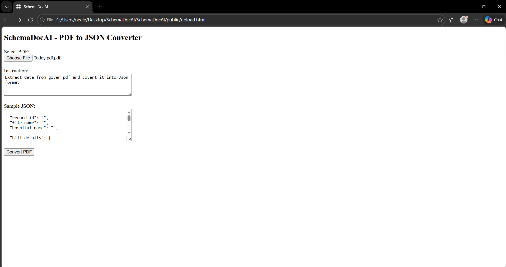
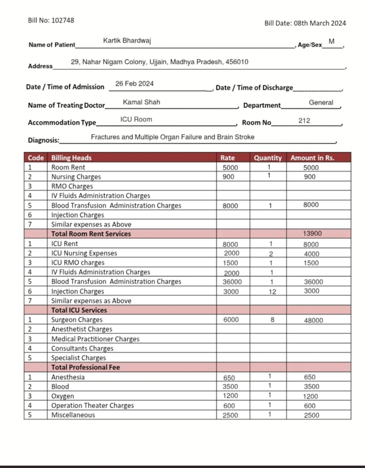
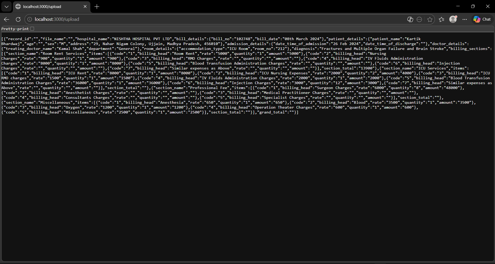
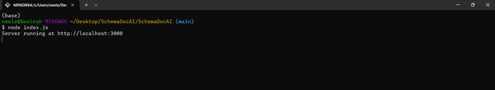

# SchemaDocAI
PDF to Structured JSON Converter using Groq Vision

## Author
Shailesh Dwivedi  
AIML Intern at Emoneeds  

## About Me
My name is Shailesh Dwivedi and I am currently working as an AIML Intern at Emoneeds. I am deeply interested in AI, backend systems and solving real world automation problems. During my internship, I got the opportunity to work on practical challenges inside the company instead of only theoretical tasks. This project was built as a solution to one of those real challenges.

## Why I Built This Project
At Emoneeds, doctors take OPD Assessments in handwritten format on physical sheets. Later, this assessment data needs to be uploaded into the backend system and stored in the company database. The process required manual typing of handwritten content into structured format, which was time consuming and repetitive.

I built SchemaDocAI to automate this workflow. The goal was to directly convert handwritten PDF assessments into structured JSON format. Once converted into JSON, the data can easily be transformed into CSV and uploaded directly into the backend database. This reduces manual effort, saves time and minimizes human error.

## Project Overview
SchemaDocAI is an AI powered backend system that converts handwritten or printed PDF documents into structured JSON format using Groq Vision. Instead of hardcoding fixed fields, the system accepts a user defined sample JSON schema. The AI then extracts data and returns output strictly matching that schema. This makes the system flexible and reusable for different document formats without changing backend code.

## How It Works
A user uploads a PDF file containing handwritten or printed assessments. The server stores the file using Multer. Each page of the PDF is converted into an image using pdf poppler. The image is converted into base64 format and sent to the Groq Vision model along with a strict instruction and the user provided JSON schema.

The model extracts relevant information and returns structured JSON. The backend safely parses the response using JSON.parse. If the PDF contains multiple pages, each page is processed and the final output is returned as an array of JSON objects.

## Tech Stack
Backend  
Node.js  
Express.js  

File Handling  
Multer  

PDF Processing  
pdf-poppler  

AI Integration  
groq sdk  
meta-llama/llama-4-scout-17b-16e-instruct  

Environment Management  
dotenv  

Frontend  
Simple HTML form served through Express static middleware  

## Project Structure

SchemaDocAI
│
├── index.js
├── .env
├── package.json
│
├── public
│   └── upload.html
│
├── uploads
├── images
└── node_modules

## Installation Steps
Clone or download the project.

Install dependencies:

npm install express multer pdf-poppler groq-sdk dotenv

Create a .env file in the root directory and add:

GROQ_API_KEY=your groq api key here

Create two folders manually if not present:

uploads
images

Start the server:

node index.js

Open in browser:

http://localhost:3000/upload.html

## Demo

### Interface

### PDF Input

### Output Example

### Server Running

## How This Helps Emoneeds
Instead of manually typing OPD assessments, doctors can upload handwritten assessment PDFs. The system converts them into structured JSON automatically. That JSON can be converted into CSV and uploaded directly into the company database. This improves workflow efficiency and reduces manual workload.

## Future Improvements
Direct JSON to CSV conversion inside the system  
Automatic database integration  
Improved frontend interface  
Cloud deployment  
Faster multi page processing  

## Conclusion
SchemaDocAI is not just a practice project. It is a real AI automation solution built during my internship to solve an actual backend workflow problem at Emoneeds. It demonstrates practical AI integration, vision based document processing and backend system development.